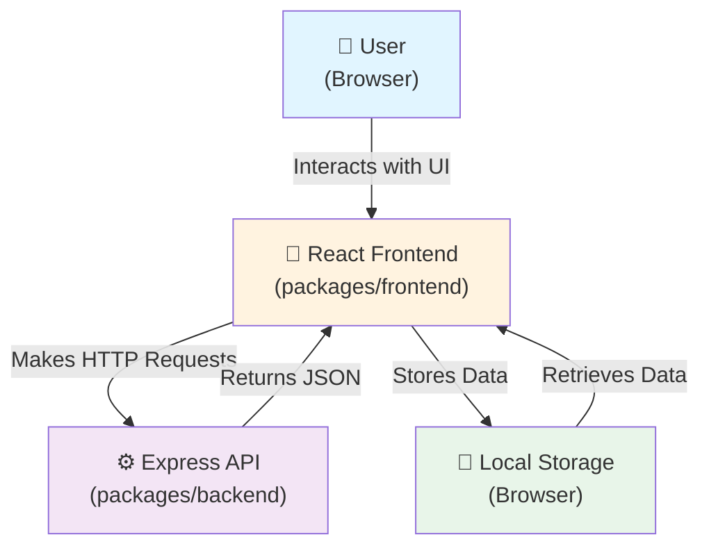
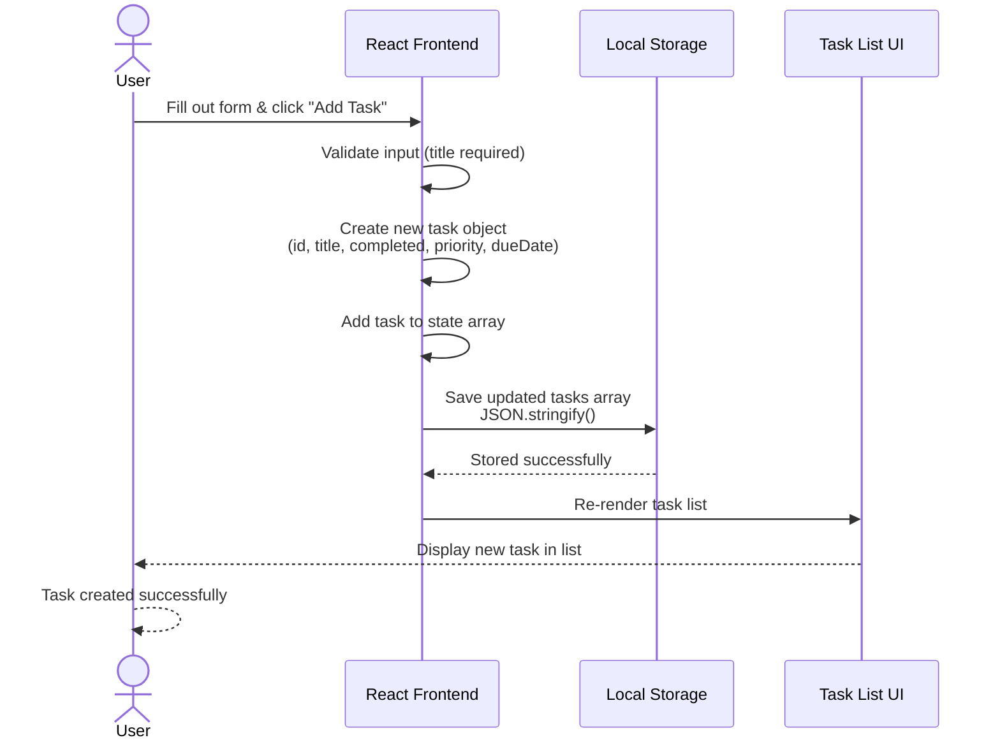

# Cloud Architecture Overview - TODO App

## System Context

This document provides an overview of the TODO app's system architecture, a full-stack monorepo application consisting of a React frontend and an Express.js API backend.

### Architecture Diagram

## System Components

### Frontend (packages/frontend)
- **Technology**: React.js
- **Purpose**: Provides the user interface for the TODO app
- **Key Responsibilities**:
  - Render task list and forms
  - Handle user interactions (add, edit, delete, filter tasks)
  - Manage UI state
  - Persist tasks to local storage
  - Display filtering and priority information

### Backend (packages/backend)
- **Technology**: Node.js with Express.js
- **Purpose**: Provides API endpoints for task management (future use)
- **Key Responsibilities**:
  - Handle HTTP requests from the frontend
  - Manage in-memory task store
  - Provide RESTful API endpoints

### Data Storage
- **Current**: Browser Local Storage
- **Scope**: MVP stores all task data in browser local storage
- **Data Model**: Tasks with title, completion status, due date, and priority

## Data Flow

1. **User Action**: User interacts with the React UI (adds, edits, deletes, or filters tasks)
2. **Frontend Processing**: React component processes the action and updates state
3. **Persistence**: Frontend saves updated tasks to browser local storage
4. **Retrieval**: Frontend retrieves tasks from local storage on app load or filter change
5. **Display**: React re-renders components to display updated task list

### User Creates a TODO - Sequence Diagram

#### Step-by-Step Process:

1. **User Input**: User enters task details (title, optional due date, optional priority) and clicks "Add Task"
2. **Validation**: React validates that the title is provided (required field)
3. **Task Creation**: React generates a new task object with:
   - Unique ID (e.g., timestamp or UUID)
   - Title (user input)
   - Completed status (default: false)
   - Priority (default: P3)
   - Due date (optional)
4. **State Update**: Task is added to the React component's task state array
5. **Persistence**: Updated tasks array is serialized to JSON and saved to local storage
6. **UI Update**: React re-renders the TaskList component to display the new task
7. **User Feedback**: New task appears in the task list view

## Deployment Considerations

### Development Environment
- Both frontend and backend run locally using `npm run start`
- Frontend serves on `http://localhost:3000`
- Backend serves on `http://localhost:5000` (or configured port)
- Data persists in browser local storage

### MVP Scope
- No external database required
- No authentication or authorization
- No cloud infrastructure needed
- Single-user, browser-based experience

### Future Considerations
- Backend database integration (e.g., PostgreSQL, MongoDB)
- User authentication and multi-user support
- Cloud deployment (AWS, Azure, GCP)
- API server deployment separate from frontend
- CDN for static frontend assets
